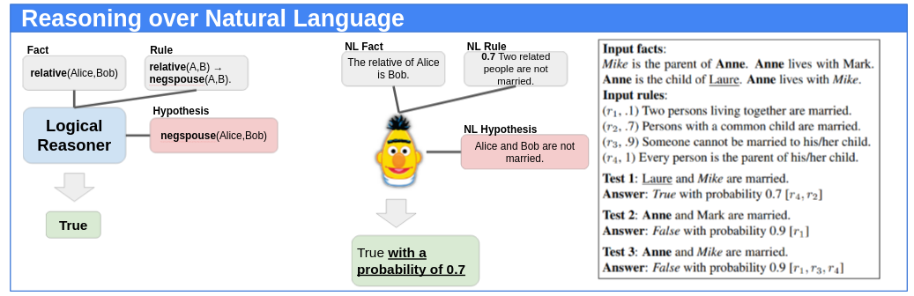

# RuleBERT: Teaching Soft Rules to Pre-Trained Language Models
[(Paper)](https://arxiv.org/pdf/2109.13006.pdf)
[(Slides)](https://docs.google.com/presentation/d/1UHOJmNlRx4OiF4-hkHMqIZ1Y9Q3QEQS5XWTaxRop4pc/edit?usp=sharing)
[(Video)](https://youtu.be/zTnA9IOIJ8k)




[RuleBERT](https://arxiv.org/pdf/2109.13006.pdf) is pre-trained language model that has been fine-tuned on soft logical results . This repo contains the required code for running the experiments of the associated paper.


## Installation
### 0. Clone Repo
```bash
git clone https://github.com/MhmdSaiid/RuleBert
cd RuleBERT
```

### 1. Create virtual env and install reqs

```bash
(optional) virtualenv -m python RuleBERT
pip install -r requirements.txt
```

### 2. Download Data
The datasets can be found [here](https://zenodo.org/record/5644677#.YYOQ3nVKhuU).
 (DISCLAIMER: ~25 GB on disk)

You can also run:
```bash
bash download_datasets.sh
```

## Run Experiments
When an experiemnt is complete, the model, the tokenizer, and the results are stored in `models/**timestamp**`.
### i) Single Rules
```bash
bash experiments/single_rules/SR.sh data/single_rules 
```

### ii) Rule Union Experiment
```bash
bash experiments/union_rules/UR.sh data/union_rules 
```

### iii) Rule Chain Experiment
```bash
bash experiments/chain_rules/CR.sh data/chain_rules 
```

### iv) External Datasets
* [__CheckList__](experiments/external_datasets/CheckList/README.md)
* [__bAbI__](experiments/external_datasets/bAbI/README.md)
* [__Negated LAMA__](experiments/external_datasets/negated_lama/README.md)
<!-- 
* __CheckList__: We refer users to the Checklist repository[insert link]. We first fine-tune model on a set of pre-defined rules that would help in QQP.
 ```bash
python trainer.py --data_dir data/train_rule_QQP/
                  --epochs 3
                  --verbose

python tester.py --test_data_dir data/test_rule_QQP/
                 --model_dir models/**timestamp**
                 --verbose
```
We then remove the original classification head and add a new one to account for the QQP task. The code can be found from [insert link]. Finally, we ran the Checklist code on the associated model. 
* __bAbI__: The dataset can be downloaded form [insert link]. We use Task #20. To run the experiments:
 ```bash
python scripts/run_bAbI.py 
```
The output results are saved in `data/external_datasets/bAbI/`.
* __Negated LAMA__: We refer the user to the LAMA repository[insert link]. The pre-finetuned model can be downloaded from [insert link]. A hugging-face connector would be needed to utilize the model. It is available in [insert path]. We have compared the HF connector with the FairSeq code and they produce the same results.
-->
## Generate Your Own Data
You can generate your own data for a single rule, a union of rules sharing the same rule head, or a chain of rules.

First, make sure you are in the correct directory.
```bash
cd data_generation
```
### 1) Single Rule 
There are two ways to data for a single rule:
#### i) Pass Data through Arguments
```bash
python DataGeneration.py 
       --rule 'spouse(A,B) :- child(A,B).' 
       --pool_list "[['Anne', 'Bob', 'Charlie'],
                    ['Frank', 'Gary', 'Paul']]" 
       --rule_support 0.67
```
* `--rule` : The rule in string format. Consult here to see how to write a rule.
* `--pool_list` : For every variable in the rule, we include a list of possible instantiations.
* `--rule_support` : A float representing the rule support. If not specified, rule defaults to a hard rule.
* `--max_num_facts` : Maximum number of facts in a generated theory.
* `--num` : Total number of theories per generated (rule,facts).
* `--TWL` : When called, we use three-way-logic instead of negation as failure. Unsatisifed predicates are no longer considered False.
* `--complementary_rules` : A string of complementary rules to add.
* `--p_bar` : Boolean to show a progress bar. Deafults to True.

#### ii) Pass a JSON file
This is more convenient for when rules are long or when there are multiple rules. The JSON file specifies the rule(s), pool list(s), and rule support(s). It is passed as an argument.

```bash
python DataGeneration.py --rule_json r1.jsonl
```

### 2) Union of Rules
For a union of rules sharing the same rule-head predicate, we pass a JSON file to the command that contaains rules with overlapping rule-head predicates.
```bash
python DataGeneration.py --rule_json Multi_rule.json 
                         --type union
```
`--type` is used to indicate which type of data generation method should be set to. For a union of rules, we use `--type union`. If `--type single` is used, we do single-rule data generation for each rule in the file.
### 3) Chained Rules
For a chain of rules, the json file should include rules that could be chained together.
```
python DataGeneration.py --rule_json chain_rules.json 
                         --type chain
```
The chain depth defaults to 5 `--chain_depth 5`.

## Train your Own Model

To fine-tune the model, run:
```bash
# train
python trainer.py --data-dir data/R1/
                  --epochs 3
                  --verbose
```
When complete, the model and tokenizer are saved in `models/**timestamp**`.

To test the model, run:
```bash
# test
python tester.py --test_data_dir data/test_R1/
                 --model_dir models/**timestamp**
                 --verbose
```
A `JSON` file will be saved in `model_dir` containing the results.


## Contact Us
For any inquiries, feel free to [contact us](mailto:saeedm@eurecom.fr), or raise an issue on Github.


## Reference
You can cite our work:

```
@inproceedings{saeed2021RuleBERT,
  title={RuleBERT: Teaching Soft Rules to Pre-Trained Language Models},
  author={Mohammed Saeed, Naser Ahmadi, Prelav Nakov, Paolo Papotti},
  booktitle={Proceedings of the 2021 Conference on Empirical Methods in Natural Language Processing (EMNLP), 2021},
  year={2021}
}
```

## License
[MIT](https://choosealicense.com/licenses/mit/)